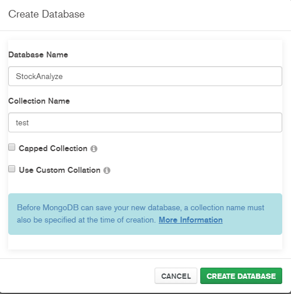
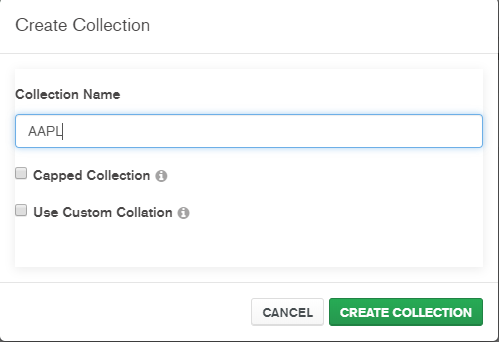
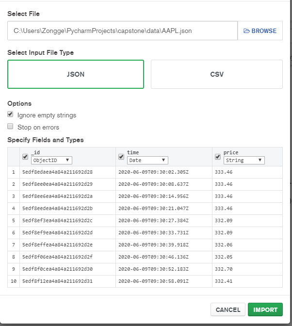
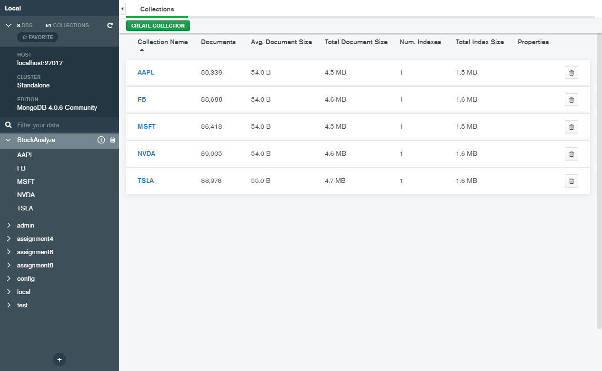

<!--
*** Thanks for checking out this README Template. If you have a suggestion that would
*** make this better, please fork the repo and create a pull request or simply open
*** an issue with the tag "enhancement".
*** Thanks again! Now go create something AMAZING! :D
-->

<!-- PROJECT SHIELDS -->
<!--
*** I'm using markdown "reference style" links for readability.
*** Reference links are enclosed in brackets [ ] instead of parentheses ( ).
*** See the bottom of this document for the declaration of the reference variables
*** for contributors-url, forks-url, etc. This is an optional, concise syntax you may use.
*** https://www.markdownguide.org/basic-syntax/#reference-style-links
-->

<!-- PROJECT LOGO -->
 

  <h3 align="center">Explore Data Analysis and Stock Forecasting Methods</h3>

  

    2020 Summer Capstone Project work by Zongge Xie.
     
    <a href="https://github.com/xie4785812/Capstone"><strong>Explore the docs »</strong></a>
     
    
    
  

<!-- TABLE OF CONTENTS -->
## Agenda

* [About the Project](#about-the-project)
  * [Built With](#built-with)
* [Related Work](#related-work)
  * [Literature](#literature)
  * [Advisor Recommendation](#advisor-recommendation)
* [Data](#data)
* [Method](#method)
* [Discussion](#discussion)
* [Conclusion](#conclusion)
* [Contact](#contact)

<!-- ABOUT THE PROJECT -->
## About The Project

In recent years, the science of combining machine learning algorithms and finance has become popular in the financial industry around the world, especially in the stock market. The prediction of stock prices through various models can more easily and steadily create revenue. This paper will mainly combine machine learning algorithms and databases to build a stock system with forecasting capabilities. We explore the relationship between stock prices, gold prices and exchange rates.

### Built With
For the data / analysis library used in this project, you can refer to the following link
* [MongoDB](https://www.mongodb.com/)
* [PyMongo](https://pymongo.readthedocs.io/en/stable/)
* [Numpy](https://numpy.org/)
* [sklearn](https://scikit-learn.org/stable/)
* [tensorflow](https://www.tensorflow.org/)
* [matplotlib](https://matplotlib.org/)

<!-- GETTING STARTED -->
## Related Work

For the relevant work of this project, some references will be used, and the opinions of the tutors in different periods will also be referenced.

### Literature

* [A data analytic approach to forecasting daily stock returns in an emerging market](https://www-sciencedirect-com.ezproxy.rit.edu/science/article/pii/S0377221716301096)
* [Large data sets and machine learning: Applications to statistical arbitrage](https://www-sciencedirect-com.ezproxy.rit.edu/science/article/pii/S0377221719303339)
* [Deep neural networks, gradient-boosted trees, random forests: Statistical arbitrage on the S&P 500](https://www-sciencedirect-com.ezproxy.rit.edu/science/article/pii/S0377221716308657)
* .[Stock Market Predictions with LSTM in Python](https://www.datacamp.com/community/tutorials/lstm-python-stock-market)

### Advisor Recommendation

<!-- USAGE EXAMPLES -->
## Data

The real-time stock data we used are all captured from Yahoo Finance, which includes data of five stocks, including the time interval for Apple, Tesla, NVIDA, FaceBook, and Microsoft to start crawling on June 9, 2020. Real-time stock data for 5 seconds. The data file provided is Json, under the file of data.

* [NVIDIA Corporation (NVDA)](https://finance.yahoo.com/quote/NVDA/history?p=NVDA)
* [Apple Inc.(AAPL)](https://finance.yahoo.com/quote/AAPL?p=AAPL&.tsrc=fin-srch)
* [Microsoft Corporation (MSFT)](https://finance.yahoo.com/quote/MSFT?p=MSFT&.tsrc=fin-srch)
* [Facebook, Inc. (FB)](https://finance.yahoo.com/quote/FB?p=FB&.tsrc=fin-srch)
* [Tesla, Inc. (TSLA)](https://finance.yahoo.com/quote/TSLA?p=TSLA&.tsrc=fin-srch)

<!-- ROADMAP -->
## How to use

First download all the data files from data, which contains the five kinds of stock data required by our model.

Open the MongoDB, click on create database, the database name must be: StockAnalyze, the collection name can input anything but not empty:

After Successfully create the database, next to create collection, there are five collections you need to create: AAPL, MSFT, NVDA, FB, TSLA:

Then to import the data, click on collection on the top of the interface, choose Import Data, then browse the data file that same as the stock data you want to import, click on IMPORT.

Then you can use this database.

Then open the location of the file through the terminal and enter python model_run.py run, you can test all models of each stock data.

    (base) ..\PycharmProject\capstone\python model_run.py run

We also support the testing of a single model of a single data, enter python model_run.py data_select feature_select model_select, where data_select includes NVDA, AAPL, MSFT, FB, MSFT, feature_select includes simple and fix(regression and status box classfication), and if choose simple, it will automatically run the regression, if you choose the fix, u will next to choose one of them: svm, bpn, hmm, hmm_box to test the case you want to.

    (base) ..\PycharmProject\capstone\python model_run.py AAPL simple

This means to use the simple feature extraction and regression to run on the AAPL real-time data

    (base) ..\PycharmProject\capstone\python model_run.py AAPL fix bpn

This means to use the status box classfication and BPN to run on the AAPL real-time data

    (base) ..\PycharmProject\capstone\python model_run.py AAPL fix svm
    
This means to use the status box classfication and SVM to run on the AAPL real-time data

    (base) ..\PycharmProject\capstone\python model_run.py AAPL fix hmm_box

This means to use the status box classfication and HMM to run on the AAPL real-time data

    (base) ..\PycharmProject\capstone\python model_run.py AAPL fix hmm

This means to use the status box classfication and HMM to run on the AAPL historical data

If something you type in wrong, it will exit the system, you need to re-enter the sentence

<!-- CONTRIBUTING -->
## Discussion
So far, the prediction results of the last minute before the closing of the five stocks are in the Png document. You can click to view the prediction results of different models corresponding to different stocks.

<!-- LICENSE -->
## Conclusion

<!-- CONTACT -->
## Contact

Your Name - [@Ted Xie]( tx5326@g.rit.edu)

Project Link: [https://github.com/xie4785812/Capstone](https://github.com/xie4785812/Capstone)

<!-- ACKNOWLEDGEMENTS -->
## Acknowledgements

<!-- MARKDOWN LINKS & IMAGES -->
<!-- https://www.markdownguide.org/basic-syntax/#reference-style-links -->
[contributors-shield]: https://img.shields.io/github/contributors/othneildrew/Best-README-Template.svg?style=flat-square
[contributors-url]: https://github.com/othneildrew/Best-README-Template/graphs/contributors
[forks-shield]: https://img.shields.io/github/forks/othneildrew/Best-README-Template.svg?style=flat-square
[forks-url]: https://github.com/othneildrew/Best-README-Template/network/members
[stars-shield]: https://img.shields.io/github/stars/othneildrew/Best-README-Template.svg?style=flat-square
[stars-url]: https://github.com/othneildrew/Best-README-Template/stargazers
[issues-shield]: https://img.shields.io/github/issues/othneildrew/Best-README-Template.svg?style=flat-square
[issues-url]: https://github.com/othneildrew/Best-README-Template/issues
[license-shield]: https://img.shields.io/github/license/othneildrew/Best-README-Template.svg?style=flat-square
[license-url]: https://github.com/othneildrew/Best-README-Template/blob/master/LICENSE.txt
[linkedin-shield]: https://img.shields.io/badge/-LinkedIn-black.svg?style=flat-square&logo=linkedin&colorB=555
[linkedin-url]: https://linkedin.com/in/othneildrew
[product-screenshot]: images/screenshot.png
